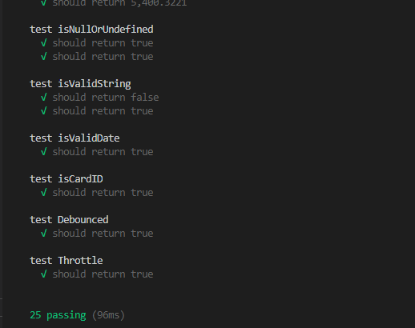

# Cobra-Utils


## 要点

* 常用工具函数的```typescript```实现
* ```ts-mocha``` + ```chai```做单元测试
* ```Rollup```打包不同模块规范的包

## 总览

### [common - 通用类](https://github.com.xbc30/cobra-utils/blob/master/src/common.ts)

* deepClone - 深拷贝
* shuffle - 随机打乱数组
* compose - 柯里化
* qsParse - 参数字符串转json对象
* qsStringify - json对象转参数字符串

### [filter - 过滤类](https://github.com.xbc30/cobra-utils/blob/master/src/filter.ts)

* filterTag - 过滤html标签
* filterSpecial - 过滤特殊字符

### [format - 格式化类](https://github.com.xbc30/cobra-utils/blob/master/src/format.ts)

* formatDateCus formatDateNumCus formatDate
* formatCountdownCus formatCountdownNumCus formatCountdown
* formatHiddenPhone formatHiddenEmail
* formatPercentage formatThousands

### [get - 获取类](https://github.com.xbc30/cobra-utils/blob/master/src/get.ts)

* getRandom - 获取某个区间[min=0, max]的随机数
* getBase64 - 获取图片base64

### [is - 判断类](https://github.com.xbc30/cobra-utils/blob/master/src/is.ts)

* isFunction isString isBoolean isPlainObject
* isUndefined isNull isNullOrUndefined
* isValid isValidString isValidDate
* isPc isBrowser
* isCardID

### [optimization - 优化类](https://github.com.xbc30/cobra-utils/blob/master/src/optimization.ts)

* Debounced - 防抖
* Throttle - 节流

### [validate - 验证类](https://github.com.xbc30/cobra-utils/blob/master/src/validate.ts)

* validateStr - 匹配验证类型

## Typescript实战

### 泛型

泛型深究起来还挺多东西的，可以看这篇 [一文读懂 TypeScript 泛型及应用](https://juejin.im/post/6844904184894980104) ，下面例子用到了```泛型条件类型```和```泛型工具类型 Record```

```typescript
export type TTarget = Record<TPropertyName, any>;
export type TDeepClone = (target: TTarget) => TTarget;
/**
 * @description 深拷贝，未考虑循环引用
 * @param {(object|array)} target - 要深拷贝的目标
 * @returns {(object|array)} - 返回 深拷贝
 */
export const deepClone: TDeepClone = (target) => {
    // 如果是json格式,调用原生JSON方法,
    // NOTES: 会忽略函数、symbol等属性,弃用
    // if (JSON.stringify(target)) {
    //   return JSON.parse(JSON.stringify(target));
    // }
    const limitTypes = ['Object', 'Array'];
    const dataType = getRawType(target);
    if (!limitTypes.includes(dataType))
        throw new BaseError('params invalid: it must one of ["Object, "Array]');

    // 统计递归次数
    let count = 0;
    const _clone = (originObj: TTarget): TTarget => {
        // 防止 循环引用，引起爆栈
        if (count > 5000) return originObj;
        count++;
        const newObj: TTarget = getRawType(originObj) === 'Array' ? [] : {};

        return Object.entries(originObj).reduce((prve, next) => {
            const [key, value] = next;
            const originType = isFunction(value) ? 'Function' : getRawType(value);
            switch (originType) {
                case 'Array':
                    prve[key] = [...value];
                    break;
                case 'Object':
                    prve[key] = _clone(value);
                    break;
                case 'Date':
                    prve[key] = new Date(value.getTime());
                    break;
                case 'Function':
                    // console.log('key:::', key);
                    // console.log('value:::', value.toString());
                    // prve[key] = eval(value.toString())
                    prve[key] = new Function(`return ${value.toString()};`)();
                    break;
                default:
                    prve[key] = value;
            }
            return prve;
        }, newObj);
    };
    const duplicate = _clone(target);
    // console.log(count);
    return duplicate;
};
```

### 枚举

```typescript
declare const window: Window;
export function isPc(): boolean {
    const userAgentInfo = window.navigator.userAgent;
    enum agentType {
        Android = "Android",
        iPhone = "iPhone",
        SymbianOS = "SymbianOS",
        iPad = "iPad",
        iPod = "iPod"
    }

    for (let item in agentType) {
        if (userAgentInfo.includes(item)) {
            return false
        }
    }
    return true;
}
```

### 接口

```typescript
/**
 * @description 判断身份证是否输入得当，并给予提示信息
 * @param {string} - id 身份证号
 * @returns {isCardIDReturn}
 */
interface isCardIDReturn {
    flag?: boolean,
    msg?: string
}
const cityNumberList: number[] = [11, 12, 13, 14, 15, 21, 22, 23, 31, 32, 33, 34, 35, 36, 37, 41, 42, 43, 44, 45, 46, 50, 51, 52, 53, 54, 61, 62, 63, 64, 65, 71, 81, 82, 91];

export function isCardID(id: string): isCardIDReturn {
    // 验证长度格式
    if (!/(^\d{15}$)|(^\d{17}(\d|X|x)$)/.test(id)) {
        return { flag: false, msg: '你输入的身份证长度或格式错误' }
    }
    // 验证身份证城市
    if (!cityNumberList.includes(parseInt(id.substr(0, 2)))) {
        return { flag: false, msg: '你的身份证地区有误' }
    }
    // 验证出生日期
    const birthday = (id.substr(6, 4) + "-" + Number(id.substr(10, 2)) + "-" + Number(id.substr(12, 2))).replace(/-/g, "/");
    const d = new Date(birthday);
    if (birthday != (d.getFullYear() + "/" + (d.getMonth() + 1) + "/" + d.getDate())) {
        return { flag: false, msg: '身份证上的出生日期非法' }
    }

    // 身份证号码校验
    let sum = 0;
    const weights = [7, 9, 10, 5, 8, 4, 2, 1, 6, 3, 7, 9, 10, 5, 8, 4, 2];
    const codes = "10X98765432";
    for (let i = 0; i < id.length - 1; i++) {
        sum += parseInt(id[i]) * weights[i];
    }
    const last = codes[sum % 11]; //计算出来的最后一位身份证号码
    if (id[id.length - 1] != last) {
        return { flag: false, msg: '你输入的身份证号有误' }
    }

    return { flag: true, msg: '输入有效' }
}
```

### 类

```typescript
/**
 * @description Anti-shake 防抖
 * @param {class} - new Class
 * @returns {Function} .use() return
 */
export class Debounced {
    /**
         * @param func need to wrap the function
         * @param delay Delay time, unit ms
         * @param immediate is executed once by default (no delay for the first time)
     */
    public use = (func: Function, delay: number, immediate: boolean = false): Function => {
        let timer: number | any
        return (...args: any) => {
            if (immediate) {
                func.apply(this, args) // Make sure that the referenced function is pointing correctly and that the function parameters are also unchanged
                immediate = false
                return
            }
            clearTimeout(timer)
            timer = setTimeout(() => {
                func.apply(this, args)
            }, delay)
        }
    }
}
```

## 单元测试

首先安装下面的模块

```JavaScript
$ npm i -D mocha chai ts-node ts-mocha @types/chai @types/mocha
```

```@types/..```相关模块为对应类库的声明文件（也即加载对应的```.d.ts```），因为在引用其他第三方的 JavaScript 库的时候，虽然通过直接引用可以调用库的类和方法，但是却无法使用TypeScript 诸如类型检查等特性功能。为了解决这个问题，需要将这些库里的函数和方法体去掉后只保留导出类型声明，而产生了一个描述 JavaScript 库和模块信息的声明文件。通过引用这个声明文件，就可以借用 TypeScript 的各种特性来使用库文件了。

### 测试用例

```javascript
describe('test formatPercentage',
  () => {

    it('should return 12%"', () => {
      const result = formatPercentage(12.00, 100);
      expect(result).to.equal("12%");
    });

    it('should return 12.01%', () => {
      const result = formatPercentage(12.0104, 100);
      expect(result).to.equal("12.01%");
    });
  }
);

describe('test formatThousands',
  () => {

    it('should return 1,200,000,000"', () => {
      const result = formatThousands("1200000000");
      expect(result).to.equal("1,200,000,000");
    });

    it('should return 5,400.3221', () => {
      const result = formatThousands("5400.3221");
      expect(result).to.equal("5,400.3221");
    });
  }
);
```

### 执行测试

```package.json```的```script```中添加如下：

```JavaScript
"script" :{
    "test": "mocha -r ts-node/register tests/*.spec.ts"
}
```

命令行执行：

```shell
$ npm run test
```

### 测试结果



## RollUp打包模块


```RollUp```相对于```Webpack```在打包类库的优势在于

* 打包出来的文件很小，几乎没什么多余代码，比webpack要轻量许多

* 执行速度相对较快

* 对 es 模块输出打包有很好的支持

```rollup.config.js```的详细配置可见上面配置

### 打包模块类型

这里选择打包```CommonJS``` ```UMD``` ```ES Module```三种类型

模块化的区别可以看 [前端模块化—CommonJS、CMD、AMD、UMD和ESM](https://juejin.im/post/6857313590337077255)

### typescript插件

选择```rollup```在```typescript```的```plugin```时，有四个类似插件

* rollup-plugin-typescript
* rollup-plugin-typescript2
* @rollup/plugin-typescript
* rollup-plugin-ts

在编译打包不成功的时候，可以试着替换不同的插件来尝试，这里使用 ```rollup-plugin-ts``` 打包成功

### 其他插件

另外，正常情况是不支持多个ts文件作为入口，这里引入 ```@rollup/plugin-multi-entry``` ，```tsconfig.json``` 和 ```rollup.config.js```同时配置入口文件即可

```javascript
// tsconfig.json
"include": [
    "src/**/*.ts",
]
```

```javascript
// rollup.config.js
input: './src/**/*.ts',
```

### 执行打包

```package.json```的```script```中添加如下：

```JavaScript
"script" :{
    "build": "rollup -c"
}
```

命令行输入以下命令即可

```shell
$ npm run build
```

### 打包结果


## 具体配置

### tsconfig.json

```javascript
{
    "compilerOptions": {
        // 允许未执行的代码不报错
        "allowUnreachableCode": true,
        // 严格模式, 强烈建议开启
        "strict": true,
        // 支持别名导入:
        // import * as React from "react"
        "esModuleInterop": true,
        // 目标js的版本
        "target": "es5",
        // 目标代码的模块结构版本
        "module": "CommonJS",
        // 在表达式和声明上有隐含的 any类型时报错。
        "noImplicitAny": true,
        // 删除注释
        "removeComments": true,
        // 保留 const和 enum声明
        "preserveConstEnums": false,
        // 生成sourceMap    
        "sourceMap": true,
        // 目标文件所在路径
        "outDir": "./lib",
        // "rootDir": "./src",
        // 编译过程中需要引入的库文件的列表
        "lib": ["ES5","ES6", "ES7", "DOM", "DOM.Iterable", "ScriptHost", "ES2016.Array.Include", "ES2017.String"],
        // 额外支持解构/forof等功能
        "downlevelIteration": true,
        // 是否生成声明文件
        "declaration": true,
        // 声明文件路径
        "declarationDir": "./lib",
        // 此处设置为node,才能解析import xx from 'xx'
        "moduleResolution": "node",
        // 禁止隐式AnyIndex错误
        "suppressImplicitAnyIndexErrors": true,
        "types": ["node"],
    },
    // 入口文件
    "include": [
        "src/**.ts",
    ]
}
```

### rollup.config.js

```javascript
// 为了让rollup识别commonjs类型的包,默认只支持导入ES6
import commonjs from '@rollup/plugin-commonjs';
// 为了支持import xx from 'xxx'
import nodeResolve from '@rollup/plugin-node-resolve';
// ts转js的编译器
import typescript from 'rollup-plugin-ts';
// 支持加载json文件
import json from '@rollup/plugin-json';
// 支持字符串替换, 比如动态读取package.json的version到代码
import replace from '@rollup/plugin-replace';
// 代码生成sourcemaps
import sourceMaps from 'rollup-plugin-sourcemaps'
// 支持多文件打包入口
import multi from '@rollup/plugin-multi-entry';
// .d.ts
import dts from "rollup-plugin-dts";

// 读取package.json
import pkg from './package.json';

// 代码头
const banner =
    `/*!
 * cobra-utils v${pkg.version}
 * (c) 2019-${new Date().getFullYear()}
 * https://github.com/xbc30/cobra-utils
 * Released under the MIT License.
 */`

export default {
    input: './src/**/*.ts',
    plugins: [
        // 代码中的__VERSION__字符串会被package.json中的version字段所替代
        replace({
            __VERSION__: pkg.version
        }),

        typescript({
            exclude: 'node_modules/**',
            typescript: require('typescript'),
        }),
        json(),
        nodeResolve({
            jsnext: true,
            main: true
        }),
        commonjs({
            include: 'node_modules/**'
        }),
        dts(),
        multi(),

        sourceMaps()
    ],
    output: [{
            format: 'cjs',
            // 生成的文件名和路径
            file: './lib/index.cjs.js',
            banner,
            sourcemap: true
        },
        {
            format: 'es',
            file: './lib/index.es.js',
            banner,
            sourcemap: true
        },
        {
            format: 'umd',
            name: 'corbra-utils',
            file: './lib/index.umd.js',
            banner,
            sourcemap: true
        }
    ],
};
```


## 总结

工具函数的封装，不仅要做到准确还要做到通用性高。本文详细讲述了用```typescript```封装常用工具函数并测试打包成```JS```模块的过程，其中用到了部分 ```typescript``` 的特性，泛型和类型声明是比较难的部分了，需要多加研究并实践，才能做到融会贯通。。最后，本文也完结了，项目代码在 [cobra-utils](https://github.com/xbc30/cobra-utils) , 欢迎 [Star](https://github.com/xbc30/cobra-utils)